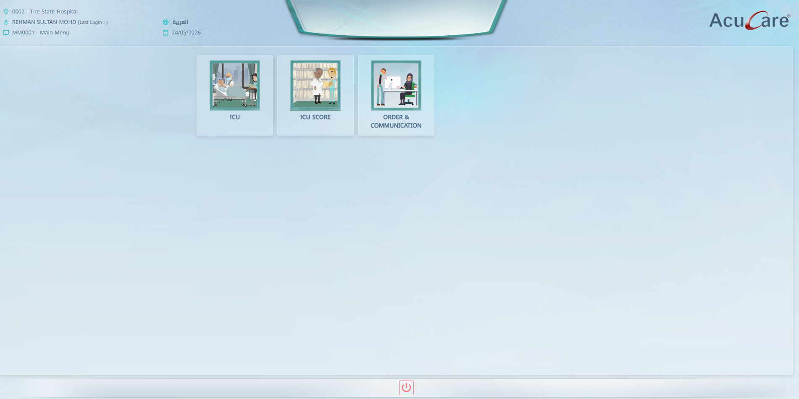
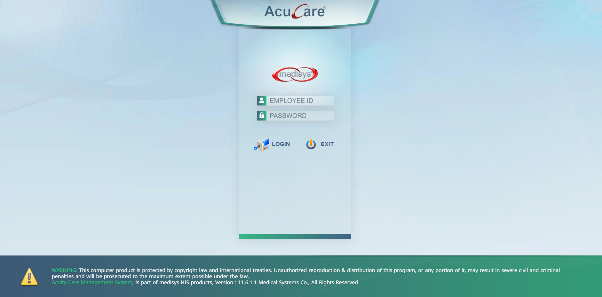
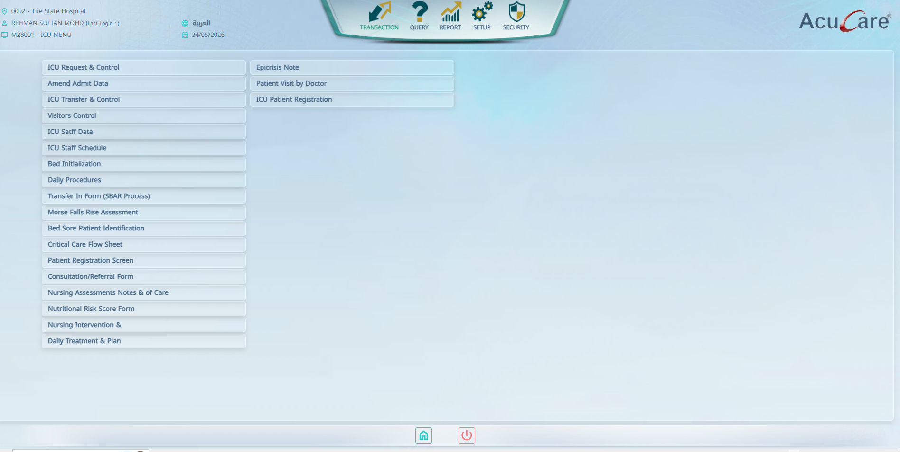
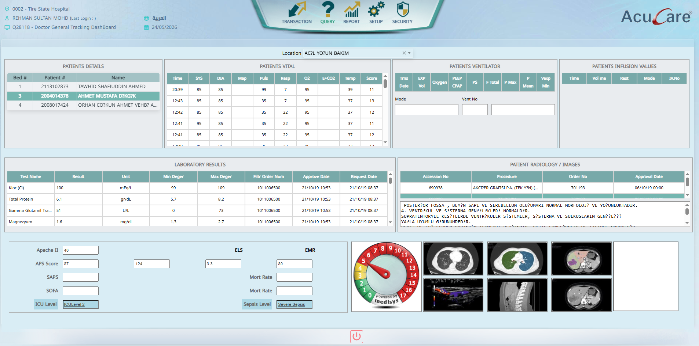

# AcuCare-Demo

  

Enterprise-level Healthcare ERP demo developed using Blazor WebAssembly , ASP.NET Core Web API, TOAD for Oracle, and layered architecture for scalable healthcare operations.

---

## Features

- Patient Management
- ICU Management
- Ward Management
- Healthcare Reporting
- Authentication & Session Management
- REST API Integration
- Modular Healthcare Workflow
- Layered Enterprise Architecture

---

## Technologies Used

### Backend
- ASP.NET Core 8
- REST API
- C#
- Session Authentication

### Frontend
- Blazor WebAssembly
- Razor Components

### Database
- Oracle Database
- Oracle Managed Data Access

### Database Tools
- TOAD for Oracle

### Reporting & Utilities
- FastReport
- ClosedXML

---

## Architecture

- Acucare.Client
- Acucare.Server
- Acucare.DAL
- Acucare.Shared

Layered enterprise healthcare architecture with reusable shared components and REST API communication.

---

## Environment

- Visual Studio 2022
- .NET 8
- Blazor WebAssembly
- ASP.NET Core Web API
- Oracle Database
- IIS Express

---

# Screenshots

## Login Page

  

---

## Dashboard

  

---

## Menu & Navigation

  

---

## ICU Module Page

  

---

## Enterprise Highlights

- Modern Blazor WebAssembly Architecture
- ASP.NET Core REST API
- Oracle-based Enterprise Healthcare System
- Layered Modular Architecture
- Reusable Shared Components
- Real-world Healthcare Domain Experience
  
--- 

## Architecture

This project follows a layered enterprise architecture pattern with separate Client, Server, Data Access, and Shared layers.

### Layers
- Presentation Layer (Blazor WebAssembly UI)
- API & Business Layer (ASP.NET Core Web API)
- Data Access Layer (Oracle Database Access)
- Shared/Common Layer
---

## Disclaimer

This repository is created for portfolio and demonstration purposes only.

Confidential business logic, production configurations, credentials, patient data, and sensitive healthcare information have been excluded for privacy and security reasons.
